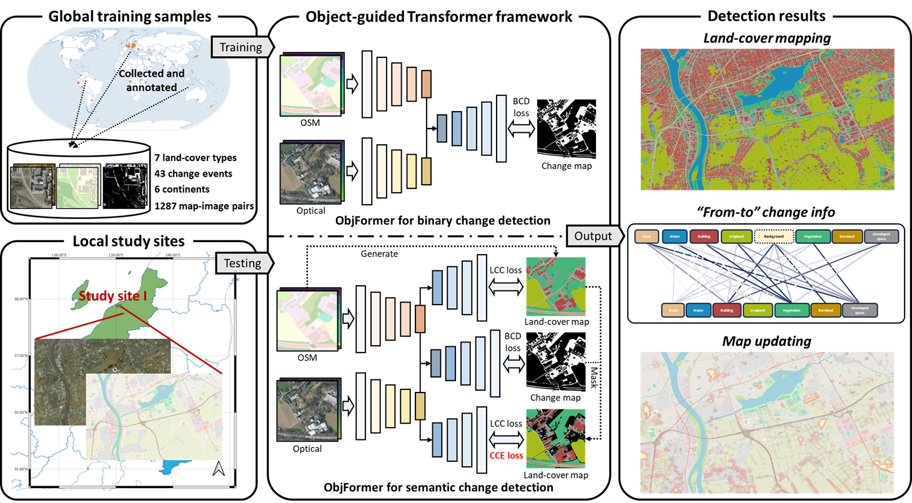

<div align="center">
<h1 align="center">ObjFormer</h1>

<h3>Change Detection on Paired OSM Data and Optical High-Resolution Imagery via Object-Guided Transformer
</h3>

[Hongruixuan Chen](https://scholar.google.ch/citations?user=XOk4Cf0AAAAJ&hl=zh-CN&oi=ao)<sup>1</sup>, [Cuiling Lan](https://scholar.google.com/citations?user=XZugqiwAAAAJ&hl=zh-CN)<sup>2</sup>, [Jian Song](https://scholar.google.ch/citations?user=CgcMFJsAAAAJ&hl=zh-CN)<sup>1,3</sup>, [Clifford Broni-Bediako](https://scholar.google.co.jp/citations?user=Ng45cnYAAAAJ&hl=en)<sup>3</sup>, [Junshi Xia](https://scholar.google.com/citations?user=n1aKdTkAAAAJ&hl=en)<sup>3</sup>, [Naoto Yokoya](https://scholar.google.co.jp/citations?user=DJ2KOn8AAAAJ&hl=en)<sup>1,3 *</sup>

[](https://ieeexplore.ieee.org/abstract/document/10551264)  [](https://arxiv.org/abs/2310.02674)


<sup>1</sup> The University of Tokyo, <sup>2</sup> Microsoft Research Asia,  <sup>3</sup> RIKEN AIP,  <sup>*</sup> Corresponding author

[**Overview**](#overview) | [**Get Started**](#%EF%B8%8Flets-get-started) | [**Taken Away**](#%EF%B8%8Fresults-taken-away) | [**Common Issues**](#common-issues) | [**Others**](#q--a) | [**简体中文版**](./README_zh-CN.md)

</div>

## 🛎️Updates
* **` Notice`**: ObjFormer has been accepted by [IEEE TGRS](https://ieeexplore.ieee.org/document/10551264)! We will upload the dataset and code soon. We'd appreciate it if you could give this repo a ⭐️**star**⭐️ and stay tuned!!
* **` July 01st, 2024`**: We have uploaded [OpenMapCD dataset](https://zenodo.org/records/12606585). You are welcome to download and use it!


## 🔭Overview

* [**OpenMapCD**](https://zenodo.org/records/12606585) is the first benchmark dataset for multimodal change detecton tasks on optical remote sensing imageyr and map data, with 1,288 samples from 40 regions across six continents, supoorting both binary and semantic change detection. 


* [**ObjFormer**](https://ieeexplore.ieee.org/document/10565926) serves as a robust and efficient benchmark for the proposed multimodal change detection tasks by combining OBIA techniques with self-attention mechanisms.



## 🗝️Let's Get Started!
### `A. Installation`

Under construction...


## 📜Reference

If this code or dataset contributes to your research, please kindly consider citing our paper and give this repo ⭐️ :)
```
@ARTICLE{Chen2024ObjFormer,
  author={Chen, Hongruixuan and Lan, Cuiling and Song, Jian and Broni-Bediako, Clifford and Xia, Junshi and Yokoya, Naoto},
  journal={IEEE Transactions on Geoscience and Remote Sensing}, 
  title={ObjFormer: Learning Land-Cover Changes From Paired OSM Data and Optical High-Resolution Imagery via Object-Guided Transformer}, 
  year={2024},
  volume={62},
  number={},
  pages={1-22},
  doi={10.1109/TGRS.2024.3410389}
}
```


## 🔗Other links
If you are interested in land-cover mapping and domain adaptation in remote sensing using synthetic datasets, you can also follow our two datasets below.

* *[OpenEarthMap dataset](https://open-earth-map.org/): a benchmark dataset for global sub-meter level land cover mapping.*

* *[SyntheWorld dataset](https://github.com/JTRNEO/SyntheWorld): a large-scale synthetic remote sensing datasets for land cover mapping and building change detection.* 

## 🙋Q & A
**For any questions, please [contact us.](mailto:Qschrx@gmail.com)**
