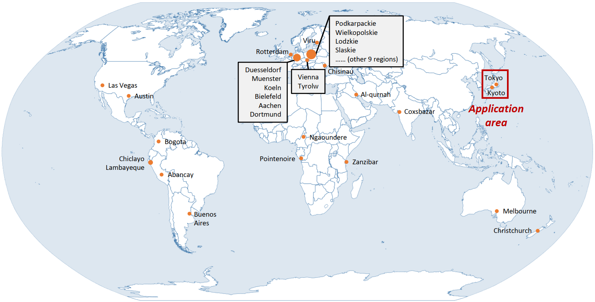
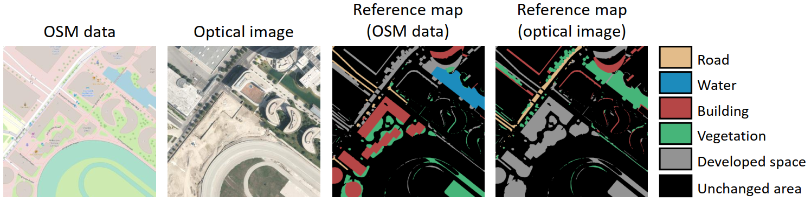
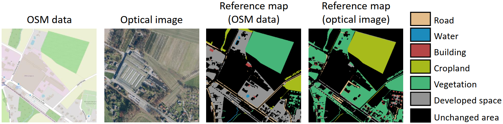
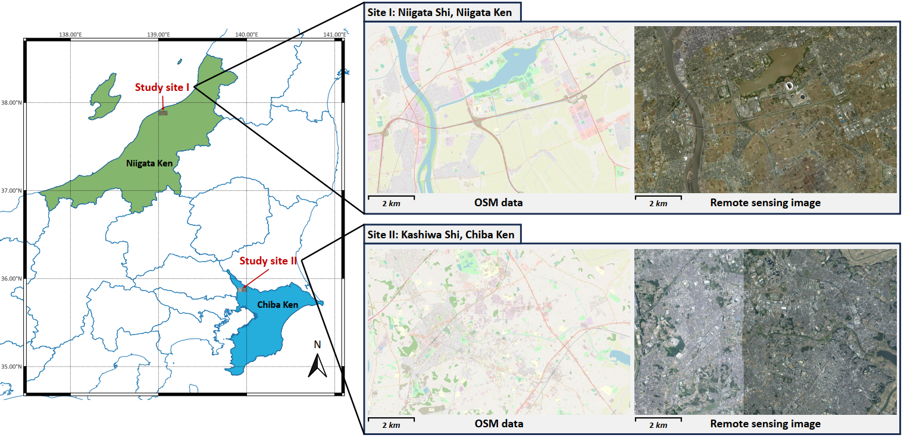
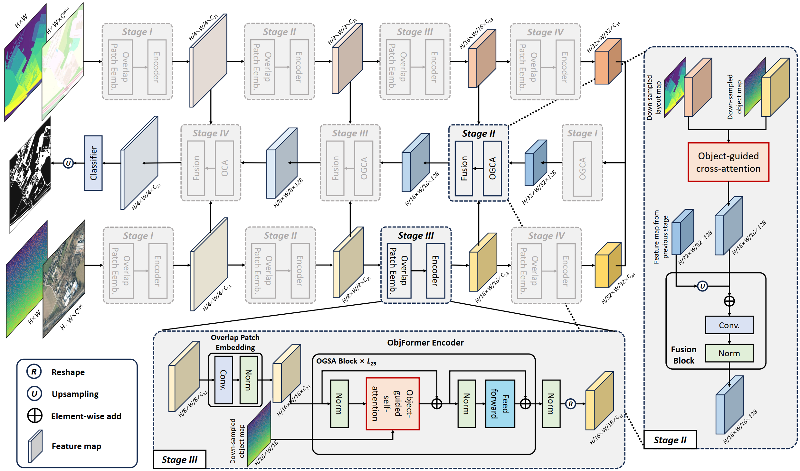

#  Object-guided Transformer for change detection using paired OSM data and optical imagery

Datasets and code for ObjFormer paper: [Land-cover change detection using paired OpenStreetMap data and optical high-resolution imagery via object-guided Transformer.](https://arxiv.org/abs/2310.02674)

## Note
- 2023.10.26: This repo is currently under active development and construction. 

## Datasets
### OpenMapCD dataset
We have constructed a global-scale benchmark dataset. This dataset contains 1,287 pair of OSM data and optical high-resolution imagery with the size of 1,024×1,024 pixels for binary and semantic change detection tasks. The download link for this dataset will be available soon.

The dataset covers 40 regions on six continents.


Two examples from this dataset:



### Two local study sites
Two Japanese cities, Niigata and Kashiwa, are selected for testing models' generalization. The download link for the two study sites will also be available. The size of the optical images covering the two study sites are 12,036×18,944 and 11,776×18,688 pixels, respectively.

Geographic location of the two study sites:




## Methodology
We propose an object-guided transformer called ObjFormer for supervised and semi-supervised semantic change detection on paired OSM data and optical imagery. By utilizing the OBIA technique, the computational overhead of self-attention can be greatly reduced. 




### Getting started
#### Installation
Create and activate conda environment
```
conda create --name ObjFormer python=3.8
conda activate ObjFormer
pip install -r requirments.txt
```
Clone this repo to your PC
```
git clone https://github.com/ChenHongruixuan/ObjFormer.git
cd ObjFormer
```

#### Object maps generation
```

```

#### Training on the benchmark dataset
```
python train_model.py
```

#### Evalution on the benchmark dataset
Evaluate the binary change detection model
```
python evalution_model.py
```

#### Inference on the local study sites (or your own dataset)
```
python inference.py
```

## Citation
If this code or dataset contributes to your research, please consider citing our paper:
```
@article{chen2023land,
  title={Land-cover change detection using paired OpenStreetMap data and optical high-resolution imagery via object-guided Transformer},
  author={Chen, Hongruixuan and Lan, Cuiling and Song, Jian and Broni-Bediako, Clifford and Xia, Junshi and Yokoya, Naoto},
  journal={arXiv preprint arXiv:2310.02674},
  year={2023}
}
```


## Other links
If you are interested in land-cover mapping and domain adaptation in remote sensing using virtual datasets, you can also follow our two datasets below.

[OpenEarthMap dataset](https://open-earth-map.org/): a benchmark dataset for global sub-meter level land cover mapping.

[SyntheWorld dataset](https://github.com/JTRNEO/SyntheWorld)
: a large-scale virtual remote sensing datasets for land cover mapping and change detection.

## Q & A
**For any questions, please [contact us.](mailto:Qschrx@gmail.com)**
